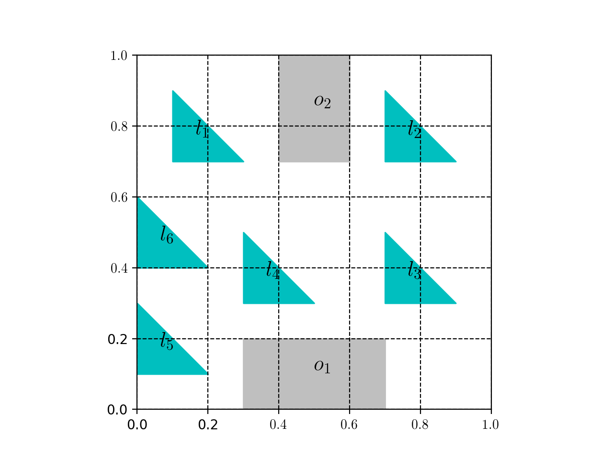

# TLRRT*

An Abstraction-Free Method for Multi-Robot Temporal Logic Optimal Control Synthesis

Tasks specified by Linear Temporal Logic can capture more complex missions compared to traditional point-to-point navigation.
The majority of existing Linear Temporal Logic (LTL) planning methods rely on the construction of a discrete product 
automaton, that combines a discrete abstraction of robot mobility and a Bu ̈chi automaton that captures the LTL specification
We propose a new sampling-based LTL planning algorithm that does not require any discrete abstraction of robot mobility.
Instead, it builds incrementally trees that explore the product state-space, until a maximum number of iterations is
reached or a feasible plan is found. The use of trees makes data storing and manipulation tractable, which significantly
increases the scalability of our algorithm. To accelerate the construction of feasible plans, we introduce bias in the
sampling process which is guided by transitions in the Buchi automaton that belong to the shortest path to the accepting
states.

# Requirements
* [Python >=3.6](https://www.python.org/downloads/)
* [sympy](https://www.sympy.org/en/index.html)
* [re]()
* [Pyvisgraph](https://github.com/TaipanRex/pyvisgraph)
* [NetworkX](https://networkx.github.io)
* [Shapely](https://github.com/Toblerity/Shapely)
* [scipy](https://www.scipy.org)
* [matplotlib](https://matplotlib.org)
* [termcolor](https://pypi.org/project/termcolor/)

# Usage

First, specify the LTL task in the file [task.py](/task.py), which mainly involves the assigned task, the number of robots
, the initial locations of robots and the minimum distance between any pair of robots, and workspace in the file [workspace.py](/workspace.py) that contains the information 
about the size of the workspace, the layout of regions and obstacles. Second, set the parameters used in the TLRRT* in the
file [construct_biased_tree.py](/construct_biased_tree.py), such as the maximum number of iterations, the step size, whether the lite version that does not use function `near`, `extend` and `rewire` in 
[biased_tree.py](/biased_tree.py) is used. Finally, after the TLRRT* terminates, the runtime and the cost of the solution is 
presented. What's more, the path composed of prefix and suffix parts for each robot is drawn with workspace layout when the number of robots is relatively small, otherwise, the path for each
robot is printed onto the screen when the number of robots is large. 

# Example

## Workspace
The workspace of size `1-by-1` is shown below, with `l_1`-`l_6` being regions and `o_1`-`o_2` being obstacles



## Case 1
The task is specified by 
```python
self.formula = '<> e1 && []<> (e2 && <> e3) && (!e3 U e4) && []!e5'
self.subformula = { 1: '(l1_1)',
                    2: '(l2_1)',
                    3: '(l3_1)',
                    4: '(l4_1)',
                    5: '(l5_1)',
                    }                     
```
## Case 2
```python
self.formula = '[]<> e1 && []<> e3 && !e1 U e2'
self.subformula = { 1: '(l1_1)',
                    2: '(l6_1)',
                    3: '(l5_2)'
                    }
```
## Case 3
```python
self.formula = '[]<> e1 && []<> e2 && []<> e3 && []<>(e4 && <>(e5 && <> e6)) && <> e7 && []<>e8 && (!e7 U e8)'
```
It presents high performance when the following code in [buchi_parse.py](buchi_parse.py) is uncommented.
```python
if ' && ' in symbol: continue
```

